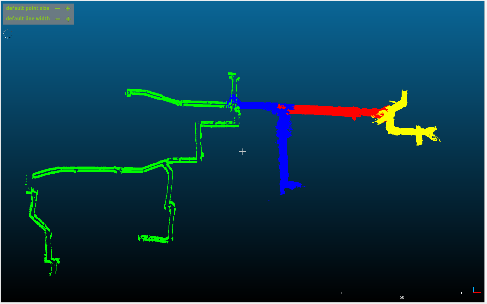
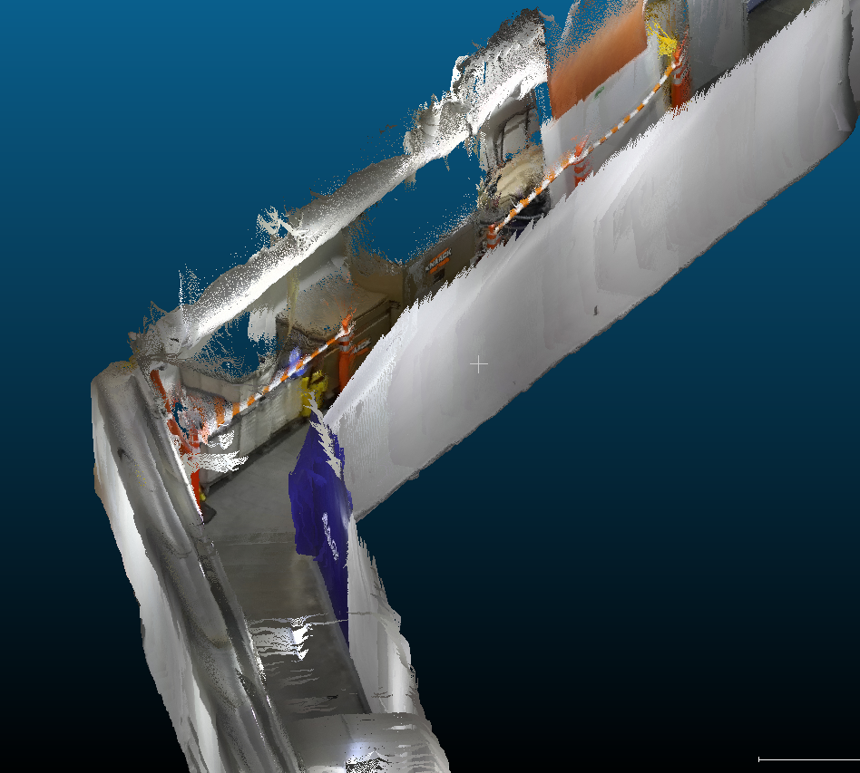

# 3D Mapping of Northeastern University Tunnels

RGB-D SLAM pipeline for dense 3D reconstruction of GPS-denied underground tunnel corridors using a ZED Mini stereo-inertial camera and RTAB-Map on ROS 2.

---

## Problem

Underground environments — utility tunnels, subway networks, collapsed structures — are operationally critical for inspection and emergency response but remain largely unmapped in 3D. GPS is unavailable, walls are featureless, and lighting is inconsistent. Standard visual SLAM systems fail here: stereo depth degrades on textureless surfaces, loop closure is unreliable without visual landmarks, and IMU drift compounds over multi-hundred-meter traversals.

The Northeastern University tunnel network was used as a real-world testbed — long uniform corridors, 90° turns, reflective glass walls, and no external positioning. The goal was a globally consistent dense 3D map from a single stereo-inertial sensor across multiple sessions.

Data collection kept camera motion below 0.5 m/s to prevent stereo tracking failure. A stabilized rolling platform reduced vibration-induced drift by ~60% compared to handheld operation.

---

## Results

  
  

*Left: RGB point cloud of a corridor section. Right: Top-down view of the full mapped network across multiple sessions.*

| Metric | Value |
|---|---|
| Total points | 45.8 million |
| Coverage area | 30,700 m² |
| Mapped length (X) | 208 m |
| Mapped width (Y) | 148 m |
| Vertical range (Z) | 12.8 m |
| Drift — stabilized | sub-meter |
| Drift — handheld | up to 1.5 m |
| Max motion speed | 0.5 m/s |

---

## Approach

**Sensor:** ZED Mini stereo camera (63mm baseline) with 6-DOF IMU. Depth via ZED SDK semi-global block matching. RGB-D at 30Hz, IMU at 200Hz over ROS 2.

**Front-end:** Stereo visual odometry for incremental pose estimation. IMU pre-integration constrains inter-frame rotation. Graph nodes added at fixed spatial intervals.

**Back-end:** RTAB-Map Bayesian bag-of-words loop closure with false positive rejection. Loop closures trigger G2O pose graph optimization for global drift correction.

**Output:** Dense RGB-D point clouds assembled and exported as PLY via RTAB-Map cloud assembler. Visualized in CloudCompare.

---

## Hardware

| Component | Spec |
|---|---|
| Camera | ZED Mini — stereo RGB-D + IMU, 63mm baseline |
| Host | Lenovo LOQ, Ubuntu 20.04, ROS 2 Humble |
| Mounting | Rolling platform for vibration isolation |

---

## Challenges

**Featureless walls** — sparse ORB keypoints on uniform tunnel surfaces made visual odometry unreliable over long stretches. Loop closures only triggered reliably at corridor intersections.

**Reflective surfaces** — glass walls produced incorrect stereo disparity, creating noisy depth regions in the point cloud.

**Baseline mismatch** — ZED Mini's 63mm baseline is optimized for short-range depth, degrading in tunnel sections where scene depth exceeded 10m.

---

## Data

Raw ROS 2 bags and PLY files available on SharePoint (Northeastern access required):
[RSN Final Project Data](https://northeastern-my.sharepoint.com/:f:/r/personal/shingate_s_northeastern_edu/Documents/RSN%20Final%20Project%20Data?csf=1&web=1&e=bWzNCz)